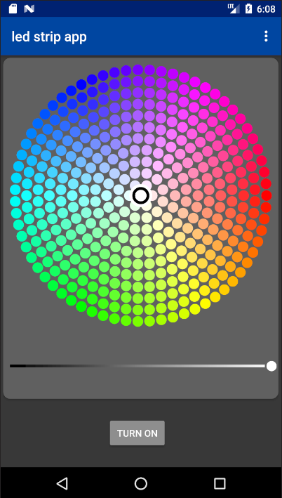

led-strip-android-app
====================================
This is an android app that allows you to control a led strip connected to a Raspberry Pi or ESP32 microcontroller.

Protocol
--------
Currently the data is transferred from the app to the led strip with a http post as a json file.
Later a transmission via the mqtt protocol should also be possible.

Pull requests
--------
Pull requests are always welcome !